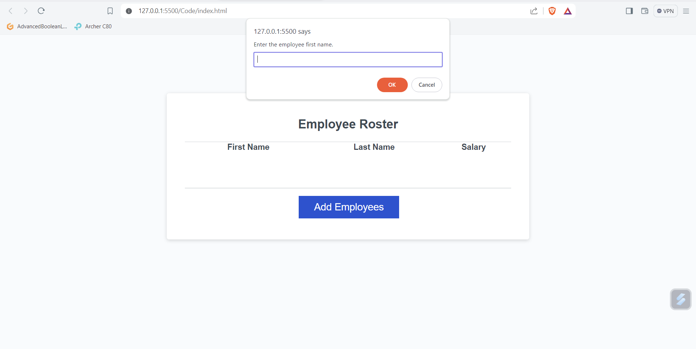

# Employee-payroll-tracker

## Description
The project is meant to track employees information by being able to add employees to the an array and storing the information there. I used starter code which was given for this project as an assignment for bootcamp. The project wasn't not build by me but an assignment used better my understanding of using arrays, methods, and objects within javascript. It solves the problem of have a more solid understanding of array, methods and objects and it helps employers track their employees information.  

## Installation

The project can be installed and used in the browser to interact with the employee tracker.

## Usage

The employee tracker is suppose to be used to track an employee's first name, last name, and their salary. When the add button is clicked on then a prompt will show up asking for more information of the employee to be filled out.

## Credits
The starter code was from Xander Rapstine and can be accessed from the link below.
https://github.com/coding-boot-camp/curly-potato

## License
N/A
